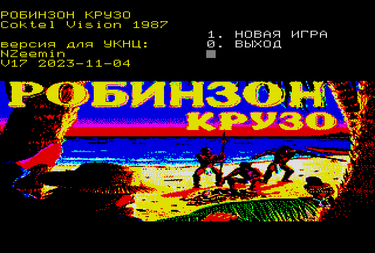
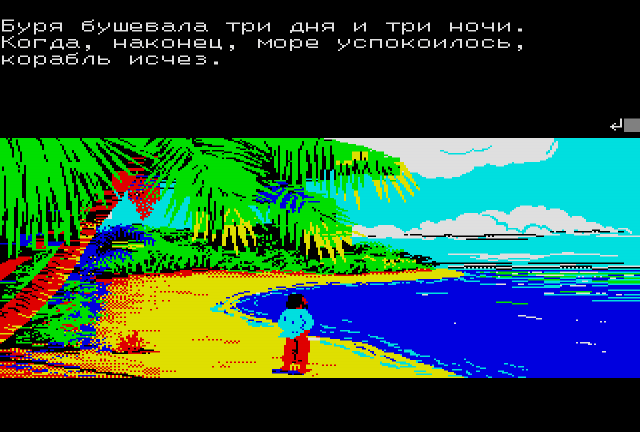

# uknc-robinson-crusoe
Porting game Robinson Cruesoe (Coktel Vision, 1987) to UKNC (Elektronika MS 0511) computer.

Портирование игры Robinson Cruesoe (Coktel Vision, 1987) на компьютер УКНЦ (Электроника МС 0511).

Состояние: в разработке.

## Оригинал

Это графический квест, основанный на известной книге. Время от времени игроку нужно делать выбор из нескольких предложенных вариантов.

Оригинал игры был выпущен под три платформы: Thomson TO/MO, Amstrad CPC, DOS EGA. Этот квест выходил только на французском языке.

 * [MobyGames - Robinson Crusoe (1987)](https://www.mobygames.com/game/26123/robinson-crusoe/)
 * Видео [Robinson Crusoe Thomson TO8D](https://youtu.be/1qqb2sJRoGU)
 * Видео [[Amstrad CPC] Robinson Crusoe - Longplay
](https://youtu.be/6pIDTV3lXWI)

## Порт на УКНЦ

Порт игры на русском языке.

Используем 8 основных цветов УКНЦ (палитра GRB), ширина 320 пикселов в основном поле, служебные строки не трогаем. Графический экран 320 x 160 в нижней части, 80 пиксельных строк (7 символьных строк) под текст вверху.

Графика используется от версии для компьютера Thomson, сконвертирована и вручную доработана для УКНЦ.
Заголовочный экран сначала сконвертирован из фото обложки игры, и затем доработан вручную.

`ROBIN.SAV` содержит основной код (~4К): запуск/выход, распаковка, меню, движок.

`ROBIN.DAT` содежит сжатый заголовочный экран (~8К) и все семь уровней (экран + вставки + код + текст) (~130-140K). В файле всё выравниваем по границе блока, расположение описывается таблицей `LEVELS`.

## Инструменты

 * [Эмулятор RT-11](http://emulator.pdp-11.org.ru/RT-11/distr/) Дмитрия Патронова
 * Стандартные MACRO и LINK от RT-11 для компиляции кода
 * Немного моего кода на C#, для того чтобы вытащить графику из оригинала и сконвертировать её, а также для сборки `ROBIN.DAT`
 * [DaDither](https://www.dadither.com/) и ручная работа в [Paint.NET](https://www.getpaint.net/), чтобы адаптировать графику к 8-цветной палитре УКНЦ
 * [LZSA3](https://github.com/purplesyringa/lzsa3) для того, чтобы упаковать графику + декомпрессор от Ивана Городецкого
 * Для тестирования использовался эмулятор UKNCBTL
